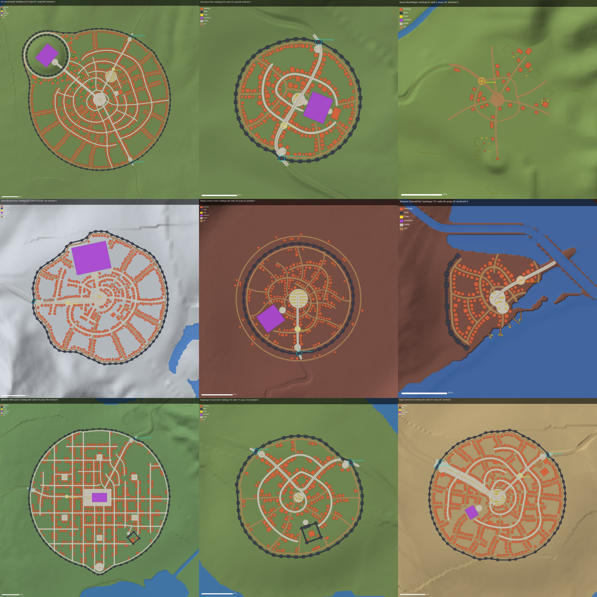

# LA PLACE cities, towns and villages

Generated by `Tools/world/generate_cities.py` (seed 20260928) from the frozen world (`Content/Data/World.json`, `Content/Data/Locations.json`, `SourceArt/World/Height.r16`, `Layers/Farmland.png`) and the architecture kit (`SourceArt/Kit/manifest_architecture.json`). Deterministic (two runs give byte-identical outputs), numpy + Pillow only. This file is rewritten on every full run.



## Rebuild

```sh
~/.venvs/mushoku-bpy311/bin/python Tools/world/generate_cities.py             # everything (~50 s)
~/.venvs/mushoku-bpy311/bin/python Tools/world/generate_cities.py --no-plans  # skip the review images
~/.venvs/mushoku-bpy311/bin/python Tools/world/generate_cities.py --sites Ars,Roa  # preview: only their plans
```

The Unreal side picks the set up with the existing importer: `Content/Python/mt_build_world.py` stage `instances` spawns every `SourceArt/World/Scatter/*.json` + `.bin` pair (tag `MTSet_Cities`).

## Outputs

| File | Content |
|---|---|
| `SourceArt/World/Scatter/Cities.json` + `Cities.bin` | instance set in the `Foliage.json` format: `Meshes` = `/Game/LaPlace/Kit/<Category>/<Asset>`; the bin is little-endian float32, 8 per record (MeshIndex, X, Y, Z cm, Yaw, Pitch, Roll deg, uniform Scale); each group is a contiguous record range |
| `SourceArt/World/Cities/StreetCobble.png`, `StreetDirt.png` | 6097 x 4573 8-bit greyscale on the landscape vertex grid (column = X, row = Y, as `Height.r16`); 255 = fully paved; the edge ramps linearly over 3.6 m (~1.2 vertices) centred on the paved edge; `dirt <= 255 - cobble` at every vertex |
| `SourceArt/World/Cities/_Plan_<SiteId>.png` | review plan per site: hillshade, water, cobble / dirt masks, every footprint as its oriented rectangle (Buildings orange, Walls slate, Props yellow, Landmark purple), gardens green, the World.json roads as thin brown lines, gates (cyan rings, labelled with their roads) and spawn / fast-travel points (yellow / orange 8 m rings) |
| `Docs/Images/LaPlace_Cities.jpg` | contact sheet: Ars, Roa, Buena, Sharia, Rikarisu, Wenport, Millishion, King Dragon, Rapan |

### Groups

One group per site and class, `City_<SiteId>_<Class>`, tags `MTCity`, `MTCity_<SiteId>`, `MTCity_<Class>`:

| Class | Collision | SpatiallyLoaded | Cull (cm) | HLODLayer | Content |
|---|---|---|---|---|---|
| Buildings | yes | yes | never | `/Game/LaPlace/World/HLOD/HLOD_City.HLOD_City` | houses, shops, inns, towers, manors, halls, keeps, chapels, barns, sheds, workshops, caravan yards, windmill body |
| Walls | yes | yes | never | `/Game/LaPlace/World/HLOD/HLOD_City.HLOD_City` | wall segments, wall towers, gates (city rings, the Ars palace ward, castle wards) |
| Props | yes | yes | 15000 - 25000 | none | lamps, fountains, statues, benches, stalls, crates, barrels, signposts, wells, haystacks, carts, fences, totems, piers, boats, windmill blades |
| Landmark | yes | **no** | never | none | `SM_Landmark_*` (Silver Palace, Ranoa University, cathedral, Roa keep, Rikarisu hall, Rapan guild, labyrinth gates): always loaded so they read from far away |

Bridges from `World.json` `Bridges[]` lie on the highways between sites, so each is its own group `City_<BridgeId>_Walls` (same settings as Walls; tags `MTCity`, `MTCity_<BridgeId>`, `MTCity_Walls`).

## Conventions

- World X east, Y south, Z up, cm; Unreal yaw 0 = +X, 90 = +Y. Layout maths runs per site in metres around the site centre.
- A kit point (bx, by, bz) m lands at local (100 bx, -100 by, 100 bz) cm, so fronts, counters, bench seats, statues, boat bows and pier water ends (Blender -Y) face local +Y: facing (dx, dy) = yaw atan2(dy, dx) - 90. Footprints are the manifest bounds mapped (x, -y); wall segments run along local X with the outer face on +Y.
- Z = lowest terrain under the footprint (sample grid <= 3.5 m, edges included) minus 15-40 cm; houses need <= 1.2 m of relief under them, big buildings <= 2.5 m. Walls follow a fitted line per straight run.

## Layout rules

- **Walls**: a polar dynamic programme picks the wall line near the wall-district radius, avoiding water, keeping every landmark and keep-in area (the Silver Palace mound, the Millishion promenade) inside and preferring gentle ground. Towers stand on a chain of straight runs of 2-4 exactly-12 m segments (one uniform scale per arc, ~0.97-1.05, so every run closes exactly on a tower or gate joint); every change of direction is inside a tower. Runs are 2 segments on tight bends or grades over 8 %. Segments pitch with their run (<= 3 deg, up to 6 deg only where a run would otherwise be buried > 2.5 m); towers and gates stay upright. Ports get landward arcs that end in towers at the shore.
- **Gates**: every road that crosses the wall line gets the style's gate, centred on the crossing and turned toward the road (<= 30 deg off the wall normal); roads crossing within 19 m share one gate; gates stay >= 24 m apart so one 12 m segment links two neighbours (Rapan's twin caravan trails get two gates). The wall runs end at the gate joints, where the gate's own towers stand. A gate square sits just inside every gate, with a signpost and goods.
- **Streets**: the World.json roads inside the walls are the main streets (gate to centre; cobble, the road's width); then squares, avenues to the landmarks and the wall-side lane. The rest comes from a tensor field (radial round the centre, aligned with the main streets and avenues, radial round the squares and the palace mound; a grid field for Millis) traced as evenly spaced streamlines of two families: long curving ring and radial streets, T-junctions where a line stops at a crossing, spacing growing from ~35 m in the core to 110-150 m near the walls. Streets are clipped at water, landmarks and walls, split into edges at every junction, and must connect to the centre.
- **Buildings** line both sides of every street edge and square, fronts to the street, 1-3 m setback, 1-4 m gaps (tighter in the core), style palettes by district and street rank (shops and inns on main streets and squares, large houses in the core, small ones on lanes; towers capped per site). The frontage is placed at full density once, then thinned toward a radial density profile by removing whole runs of houses (gardens between rows; Millis may also drop whole minor grid edges), bisected to the site's budget. Separating-axis tests keep >= 1 m between buildings; a 0.5 m raster keeps them off streets (+0.35 m), squares, water (+4 m shore), walls (+2 m), landmarks and the outside of the wall.
- **Density**: continuous rows in the core, rows broken by gardens toward the walls, never below a floor (so there is no empty ring). Budgets: Ars ~680, Sharia / Millishion / Rapan ~330-350, towns 60-150, villages 25-45.
- **Spawn / fast-travel points** inside a site get a paved clearing of r = 10 m; nothing stands within 8.5 m.
- **Props**: lamp posts just outside the paved edge of main streets, avenues and rings; fountain, statues and benches on squares, forecourts and noble gardens (always off the street bands); rows of stalls with crates and barrels on market squares, leaving the through-road corridor clear; demon stalls and totems; wells, haystacks, carts, paddock fences and fences along the Farmland edges in the village; piers (deck at bank level, water end seaward) and moored boats (Z = 0) at harbour docks; windmill blades at the body's hub anchor.

## Per-site results

| Site | Style | Buildings | Walls (seg / tower / gate) | Props | Landmark | Street km | Overlaps | On street (bld / props) | In water |
|---|---|---:|---|---:|---:|---:|---:|---|---:|
| Ars | AsuraCapital | 1374 | 427 (302 / 122 / 3) | 689 | 1 | 13.6 | 0 | 0 / 0 | 0 |
| Roa | AsuraTown | 239 | 132 (90 / 40 / 2) | 89 | 1 | 2.9 | 0 | 0 / 0 | 0 |
| Buena | RuralVillage | 34 | 0 (0 / 0 / 0) | 125 | 0 | 1.2 | 0 | 0 / 0 | 0 |
| Sharia | NorthernCity | 532 | 219 (148 / 70 / 1) | 148 | 1 | 5.7 | 0 | 0 / 0 | 0 |
| Rikarisu | DemonTown | 260 | 136 (91 / 44 / 1) | 62 | 1 | 4.5 | 0 | 0 / 0 | 0 |
| Wenport | DemonPort | 113 | 28 (19 / 9 / 0) | 29 | 0 | 1.1 | 0 | 0 / 0 | 0 |
| ZantPort | MillisPort | 99 | 70 (46 / 23 / 1) | 66 | 0 | 1.4 | 0 | 0 / 0 | 0 |
| Millishion | MillisCapital | 889 | 310 (226 / 81 / 3) | 798 | 1 | 12.2 | 0 | 0 / 0 | 0 |
| WestPort | MillisPort | 106 | 65 (43 / 21 / 1) | 103 | 0 | 1.6 | 0 | 0 / 0 | 0 |
| EastPort | AsuraTown | 63 | 33 (22 / 10 / 1) | 46 | 0 | 0.7 | 0 | 0 / 0 | 0 |
| KingDragon | AsuraTown | 219 | 171 (118 / 50 / 3) | 125 | 0 | 3.6 | 0 | 0 / 0 | 0 |
| Rapan | DesertCity | 602 | 197 (137 / 57 / 3) | 287 | 1 | 7.2 | 0 | 0 / 0 | 0 |
| Labyrinth_1 | LabyrinthGate | 0 | 0 (0 / 0 / 0) | 4 | 1 | 0.0 | 0 | 0 / 0 | 0 |
| Labyrinth_2 | LabyrinthGate | 0 | 0 (0 / 0 / 0) | 4 | 1 | 0.0 | 0 | 0 / 0 | 0 |
| Labyrinth_3 | LabyrinthGate | 0 | 0 (0 / 0 / 0) | 4 | 1 | 0.0 | 0 | 0 / 0 | 0 |
| Labyrinth_4 | LabyrinthGate | 0 | 0 (0 / 0 / 0) | 4 | 1 | 0.0 | 0 | 0 / 0 | 0 |
| Labyrinth_5 | LabyrinthGate | 0 | 0 (0 / 0 / 0) | 4 | 1 | 0.0 | 0 | 0 / 0 | 0 |
| SwordSanctuary | NorthernVillage | 27 | 0 (0 / 0 / 0) | 7 | 0 | 0.3 | 0 | 0 / 0 | 0 |
| **Total** | | **4557** | **1788** | **2594** | **11** | | | | |

Checks are exact geometry on the final layout: *overlaps* = building / landmark footprints intersecting each other or a wall piece (compound pieces excepted); *on street* = a building outline within 0.3 m of a paved street band, or a prop (piers, boats and blades excepted) standing on one; *in water* = a footprint over sea, lake or river. Every building also keeps >= 1 m (separating-axis test) from every other building.

### Gates

- Ars: SouthRoad at (197, 384) m; KingsHighway at (194, -386) m
- Roa: FittoaLane/KingsHighway at (-48, 167) m; NorthRoad at (57, -163) m
- Sharia: NorthRoad/SanctuaryTrail at (-278, 11) m
- Rikarisu: CraterRoad at (2, 176) m
- ZantPort: HolySwordHighway at (-7, 126) m
- Millishion: HolyRoad at (-400, -49) m; HolySwordHighway at (198, -338) m
- WestPort: HolyRoad at (114, -24) m
- EastPort: SouthRoad at (-100, -52) m
- KingDragon: SouthRoad at (-137, -148) m; SouthRoad at (169, -113) m
- Rapan: Gate5Road at (-240, -121) m; Gate4Road at (-228, -142) m; HarbourRoad at (200, -169) m

### Bridges

| Bridge | Mesh | Span (m) | Uniform scale | Deck Z (cm) |
|---|---|---:|---:|---:|
| Bridge_01 | `SM_Bridge_Stone_24m` | 23.9 | 0.996 | 2310 |
| Bridge_02 | `SM_Bridge_Stone_24m` | 23.9 | 0.996 | 2310 |
| Bridge_03 | `SM_Bridge_Stone_24m` | 40.5 | 1.686 | 1381 |
| Bridge_04 | `SM_Bridge_Stone_24m` | 24.0 | 0.999 | 2974 |
| Bridge_05 | `SM_Bridge_Stone_24m` | 24.0 | 1.000 | 4323 |
| Bridge_06 | `SM_Bridge_Stone_24m` | 30.0 | 1.250 | 338 |

Each bridge runs from `Start` to `End` (local X along the span, pivot at mid-span) at `DeckZ`, with the deck ends on the banks; the 24 m three-arch bridge is scaled uniformly to the span (the 42 m Ars river crossing is 1.69x).

## Spawn points and preview cameras

- Ars / `Ars`: paved clearing r = 10 m, nearest placed object 10.0 m away; preview camera clear (1284 m away, open sight line to the spawn).
- Roa / `Roa`: paved clearing r = 10 m, nearest placed object 9.8 m away; preview camera clear (388 m away; the last stretch of the sight line down to the spawn crosses 1 building bounding box, the farthest 31 m from the spawn).
- Buena / `Buena`: paved clearing r = 10 m, nearest placed object 22.3 m away; preview camera clear (268 m away, open sight line to the spawn).
- Sharia / `Sharia`: paved clearing r = 10 m, nearest placed object 10.5 m away; preview camera clear (783 m away; the last stretch of the sight line down to the spawn crosses 2 building bounding boxes, the farthest 204 m from the spawn).
- Rikarisu / `Rikarisu`: paved clearing r = 10 m, nearest placed object 10.9 m away; preview camera clear (604 m away; the last stretch of the sight line down to the spawn crosses 1 building bounding box, the farthest 17 m from the spawn).
- Wenport / `Wenport`: paved clearing r = 10 m, nearest placed object 10.4 m away; preview camera clear (398 m away; the last stretch of the sight line down to the spawn crosses 2 building bounding boxes, the farthest 49 m from the spawn).
- ZantPort / `ZantPort`: paved clearing r = 10 m, nearest placed object 10.2 m away; preview camera clear (366 m away; the last stretch of the sight line down to the spawn crosses 2 building bounding boxes, the farthest 45 m from the spawn).
- Millishion / `Millishion`: paved clearing r = 10 m, nearest placed object 11.0 m away; preview camera clear (1089 m away; the last stretch of the sight line down to the spawn crosses 2 building bounding boxes, the farthest 50 m from the spawn).
- Rapan / `Rapan`: paved clearing r = 10 m, nearest placed object 11.4 m away; preview camera clear (767 m away; the last stretch of the sight line down to the spawn crosses 2 building bounding boxes, the farthest 29 m from the spawn).

## Site notes

- Ars: the Silver Palace mound lies on the wall-district ring (418 m out), so the city wall bulges round the mound; the palace ward is closed by a white Noble wall ring at the foot of the mound with a Noble gate on the processional avenue; the noble quarter (Noble houses, gardens with fountains / statues, manors) fills the mound's surroundings and lines the avenue; the Royal Market and the Hall of Government sit at their landmarks.
- Sharia: Ranoa University slides ~24 m off its landmark to the flattest nearby ground; the 2.6 m left under its 148 m length is the generator's 1.55 % site-plane tilt.
- Rikarisu: no wall district in World.json, so the Demon wall rings the 'Dense Streets' district (0.8 R) and the 'Rock Dwellings' are huts in clusters along a path round the town outside the wall, on the flat crater floor.
- Labyrinth gates: the site generator left a flat apron ~30 m deep in front of each rock face, so each gate slides back toward the rock (32-48 m) until its facade stands on the apron and its back is buried 6-19 m in the slope; it turns at most 30 deg toward the approach road.
- Buena: the Greyrat house slides 14 m onto the flat top of its rise (the landmark point is at the foot of a natural hill); the windmill sits on its mound with the blades on the hub anchor. No walls.
- Wenport and the ports: the wall covers only the landward arcs; roads that reach the town from the water side (Wenport's Crater Road over Bridge_06) need no gate.

Generator log:

- Roa: SM_Asura_Manor_A moved 1 m / turned to flatter ground (relief 0.4 m)
- Buena: SM_Rural_GreyratHouse moved 14 m / turned to flatter ground (relief 0.0 m)
- Sharia: SM_Landmark_RanoaUniversity moved 24 m / turned to flatter ground (relief 2.6 m)
- Sharia: ground under SM_Landmark_RanoaUniversity varies 2.6 m
- SwordSanctuary: SM_North_Guild_A moved 10 m / turned to flatter ground (relief 0.3 m)

Kit assets not placed: `SM_Bridge_Stone_12m`, `SM_Bridge_Wood_10m`.

