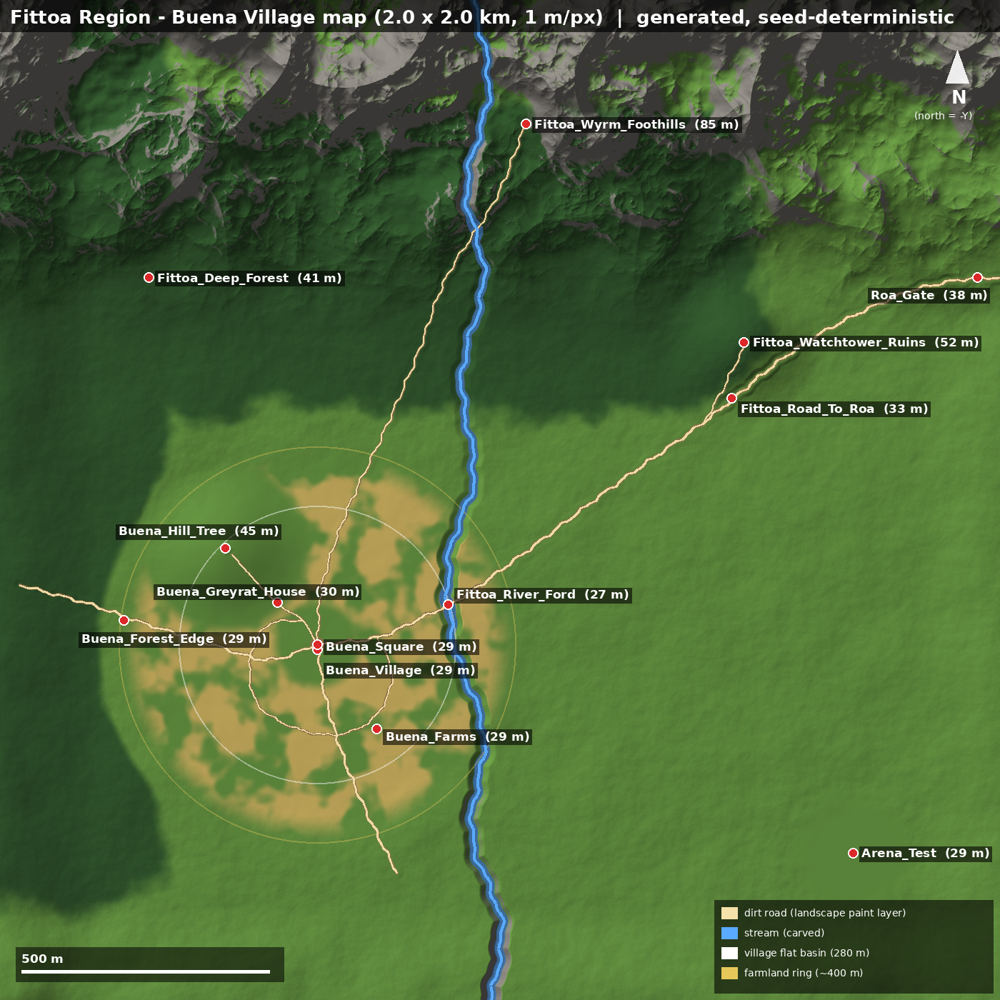

# World: Fittoa Region / Buena Village

## 1. Lore summary and sources

Lore check, 2026-09-28. The fandom wiki pages (Fittoa_Region, Buena_Village, World_Map) could **not be fetched**
because the egress proxy blocked the domain. The only cross-check was a web search that returned wiki snippets.
Treat anything not marked "confirmed" as an assumption.

| Claim | Status | Source |
|---|---|---|
| Fittoa is a region (fiefdom) of the Asura Kingdom on the Central Continent, in its north / north-east, ruled by the Boreas Greyrat family | Confirmed (search snippet + brief) | [Fittoa Region (wiki)](https://mushokutensei.fandom.com/wiki/Fittoa_Region) |
| Fittoa is a vast agricultural area on the kingdom's border | Confirmed (search snippet) | same |
| The Citadel of Roa is the largest settlement and the lord's seat | Confirmed | same |
| Buena is a small hamlet on the Fittoa plains, surrounded by fields and prairie. About 30 households, houses built far apart. Main produce is Asuran wheat. | Confirmed (search snippet) | [Buena Village (wiki)](https://mushokutensei.fandom.com/wiki/Buena_Village) |
| Buena lies in northern Fittoa, towards the east-west corridor of the Red Wyrm Mountains | Confirmed (search snippet) | same |
| Paul Greyrat served there as a knight. The Greyrat house is in the village. | Confirmed (brief) | same |
| A hill with a single big tree near the village, where Rudeus practised magic | Confirmed (brief / canon) | same |
| The whole region was wiped out by the Displacement (Teleport) Incident | Confirmed (brief) | same |
| Stream running north to south, east of the village, with a ford | **ASSUMPTION** (gameplay/landscape choice) | none |
| Roa lies to the north-east of Buena. The road leaves the map at the NE edge. | **ASSUMPTION**. The real distance is days of travel, so `Roa_Gate` is a waystone / level-transition point, not the citadel. | none |
| Old watchtower ruins on a rise to the north-east | **ASSUMPTION** (invented POI) | none |
| Scale of the foothills (about 85 to 235 m in this 2 km tile) | **ASSUMPTION** | none |
| Greyrat house on the village edge towards the hill | **ASSUMPTION** | none |

Timeline note. The playable Buena shown here is **before** the Displacement Incident: an intact village. A
post-incident variant (empty meadow) could be a Data Layer swap later. That is **not built**.

## 2. Layout (2016 m x 2016 m, 1 m/px, north = -Y)

Key coordinates are in UE cm. Z comes from the generated heightmap, and the full list is in
`Content/Data/Locations.json`.

| LocationID | X | Y | Z | Why here |
|---|---|---|---|---|
| Buena_Square | -36800 | 29200 | 2945 | Centre of the flat basin in the south-west third. The roads meet here. There is a well, and a 14 m dirt square painted into the landscape. |
| Buena_Village | -36800 | 30200 | 2945 | Discovery radius 300 m, fast travel |
| Buena_Greyrat_House | -44800 | 20700 | 3044 | Village edge on the hill path (hero asset, placed by hand) |
| Buena_Farms | -24800 | 46200 | 2944 | Farmland ring, 70 to 400 m from the square |
| Buena_Hill_Tree | -55300 | 9700 | 4451 | Lone hill about 15 m above the basin. Forest is kept off it so the single tree reads. |
| Buena_Forest_Edge | -75800 | 24200 | 2900 | West road enters the forest band |
| Fittoa_River_Ford | -10493 | 21096 | 2718 | Roa road crosses the stream. The ford is about 45 cm deep and 22 m wide. |
| Fittoa_Deep_Forest | -70800 | -44800 | 4097 | North-west forest |
| Fittoa_Watchtower_Ruins | 49200 | -31800 | 5175 | 22 m rise with a spur trail from the Roa road |
| Fittoa_Road_To_Roa | 46770 | -20504 | 3313 | Mid-point of the Roa road |
| Roa_Gate | 96300 | -44800 | 3834 | Roa road exits at the east/north-east edge (waystone / transition) |
| Fittoa_Wyrm_Foothills | 5200 | -75800 | 8473 | Ridged foothills along the whole northern border |
| Arena_Test | 71200 | 71200 | 2875 | Flattened 75 m pad in the south-east, 1.16 km from the village |

Why the layout looks like this:
- **Basin.** The village sits in a gently flattened basin: 280 m fully flat (with ±0.35 m micro relief), blending
  back to the countryside by 450 m. Buildings pass the slope rules easily, and the long sight lines match "vast
  plains".
- **Fields and forest.** The farmland ring surrounds the village. Forest covers the west and north bands (mixed
  forest). The hill and the arena are kept clear of forest.
- **Stream.** It is carved with a bed profile that only descends from north to south (a cumulative minimum along the
  channel). It only ever cuts into the ground and never builds levees. Banks blend over 16 m. Every road or trail that
  crosses it gets a shallow crossing, so it is never a 2.4 m trench.
- **Roads.** Road cut/fill blends the terrain toward a smoothed height profile along each road: 12 m shoulders, never
  steps.
- **Map edges.** A 150 to 190 m rim of higher ground on the west, south and east (with a gap for the Roa road) is the
  "distant terrain" and natural boundary. The playable area and the NavMesh cover the inner 1.8 km. A low-poly
  backdrop mesh or a second, coarser landscape for true long-distance views is **not built**.

## 3. World Partition, HLOD, Data Layers and streaming

- **Map.** `/Game/Maps/L_Fittoa` is created from the Open World template, so World Partition is on
  (`Content/Python/mt_world_setup.py`).
- **Runtime grid.** One grid, `MainGrid`: cell size **12800 cm**, loading range **25600 cm**, priority 0. The
  landscape uses a grid size of 2 components, which gives 252 m streaming proxies.
- **Always loaded** (Is Spatially Loaded off): sun, sky light, fog, sky atmosphere, MT_DayNightController,
  NavMeshBounds, PlayerStart, and the MTVillageGenerator. The generator's HISM components live on it. Its spawned
  buildings are separate spatially loaded actors.
- **HLOD layers.** `HLOD_Fittoa_Instanced` (Instancing) for trees, wheat and props. `HLOD_Fittoa_Merged` (Merged
  Mesh) for buildings. The setup script tries `unreal.HLODLayerFactory`. If that fails it prints manual steps. Build
  with Build > Build HLODs, or run `-run=WorldPartitionBuilderCommandlet -Builder=WorldPartitionHLODsBuilder`.
- **Data Layers** (runtime):
  - `Buena_Day`: starts Activated.
  - `Buena_Night`: lamps and emissive windows tagged `MTNightLight`. `AMTDayNightController::OnNightChanged` toggles
    their lights automatically, and the layer can also be activated from Blueprint.
  - `Quests`: starts Unloaded and is streamed by the quest system.
  - The setup script tries to create these with `unreal.DataLayerFactory`. Instances must be added in the Data Layers
    outliner.
- **Budget.** The village (well under 300 m) fits in about 4 cells. The generator caps trees with `MaxTrees` (2500)
  and puts cull distances on its HISMs: wheat 150 m, fences 200 m, props 120 m, trees 600 m.

## 4. Z-fighting and overlap prevention rules (enforced in code)

1. **Roads are painted, not meshed.** The visible road is the `dirt_road` weight layer, produced by
   `Tools/generate_fittoa_terrain.py` and imported with the landscape. Nothing is coplanar with the ground, so there
   is no z-fighting. The generator keeps the road polylines in `USplineComponent`s only as data (placement, AI,
   debugging). Procedural fallback roads can be exported with `ExportRoadsJson()` and painted with
   `generate_fittoa_terrain.py --extra-roads`.
2. **Ground spells and markers use decals** (or projected materials), never flat planes laid on the ground. The
   combat telegraph system should follow this. `FindCoplanarOverlaps` flags violations.
3. **Every generated placement goes through `UMTPlacementValidator`.**
   - Oriented-footprint SAT against the registry: houses, barns, fields, the well, props and trees.
   - Exclusion zones: well square, 3 m door-front clearance, hero spots (Greyrat house, hill), and extra zones.
   - Distance to road and river polylines.
   - Same-kind spacing (houses 25 m, barns 30 m).
   - Corner-trace slope rules (buildings: 90 cm delta / 10°; props: 40 cm / 15°; fields: 5 m / 12°).
   - A world-collision box test against existing WorldStatic geometry (landscape ignored).
4. **Buildings never float or sink.** They snap to the average of the corner heights. A foundation offset lifts the
   floor above the highest corner, and the plinth is buried 20 cm below the lowest corner. The plinth is inset 5 cm
   and ends 1 cm under the floor, so there are no coplanar faces.
5. **Fences.** Each segment snaps its posts to the ground. A segment places only its start post, so the next segment
   or the next edge's corner owns the end post and corners never get double posts. Rails are 4 cm shorter than the
   post spacing, so rail ends hide inside the posts. There is a gate gap on the road side of each field, closed with
   a post.
6. **Spawn and quest points** must pass a pawn-capsule overlap (42 x 96 cm) against everything generated, plus a
   below-landscape check.
7. **Validation.** `UMTWorldValidationLibrary` provides `FindDuplicateMeshes` (including ISM/HISM instances),
   `FindCoplanarOverlaps`, `FindInterpenetratingBuildings`, `FindActorsInsideGeometry`, `FindBelowLandscape` and
   `FindFloatingProps`. Run it from `mt_validate_world.py`, or headless with
   `UnrealEditor-Cmd MushokuRPG -run=MTValidateWorld -map=/Game/Maps/L_Fittoa`, which writes
   `Saved/Validation/L_Fittoa.json` and exits non-zero on errors. Use it as a CI gate.

## 5. Day / night

`UMTTimeOfDaySubsystem` exists only in Game and PIE worlds. It starts at 08:00, a day lasts 48 real minutes, and night
is 18:30 to 05:30.

`AMTDayNightController` handles the lighting:
- **Sun.** A tilted circular orbit: rises in the east (+X), noon elevation 62° to the south (+Y), sets in the west.
- **Colour.** Temperature comes from an `FRichCurve`: 2200 to 2600 K at the horizon, 6000 K at noon.
- **Night floor.** Moonlight never drops below 0.08 lux. The sky light never drops below 0.35. Night fog is denser
  and bluer.
- **Sky recapture.** Only when at least 15 in-game minutes have passed **and** something changed noticeably (sun
  elevation by 4° or more, sky intensity by 15% or more, or night turned on/off). A real-time-capture sky light is
  never recaptured. Updates run every 0.1 s, not every frame.
- **Night lights.** `OnNightChanged(bool)` drives lamps and windows.
- **Setup.** The sun directional light must be **Movable** (the setup script sets this).
- **Exposure.** For readable nights, set the PostProcessVolume auto exposure to Min EV100 = -3, Max EV100 = 14.

## 6. Honest status: what is blockout and what is final

| Item | Status |
|---|---|
| C++: time-of-day subsystem, day/night controller, placement validator, village generator, validation library, commandlet | **Written, NOT compiled** (no UE in this container) |
| Heightmap, weight maps, locations, roads JSON, overview map | **Generated and checked here.** First-pass terrain. It needs an artist pass: erosion, hand-sculpted hero hill, riverbank detail. |
| Houses, barns, well, wheat, fences, trees, props | **BLOCKOUT.** Engine basic shapes (cube, cylinder, cone) until the mesh slots are filled. Every fallback is logged with `[BLOCKOUT]` and listed in the generation report. |
| Landscape material (6 layers) | **Not made.** The layer names are fixed, so the material must use `grass, farmland, forest_floor, dirt_road, riverbed, rock`. |
| Water surface for the stream | **Not made.** Only the carved channel and the riverbed layer exist. |
| Greyrat house and the lone tree | **Not made.** Hero assets to place by hand. The generator keeps exclusion zones free for them. |
| HLOD layers and Data Layers | Created by script when the Python API allows it. Otherwise follow the manual steps it prints. |
| NavMesh | A bounds volume is placed. Nav is not built or tested. |
